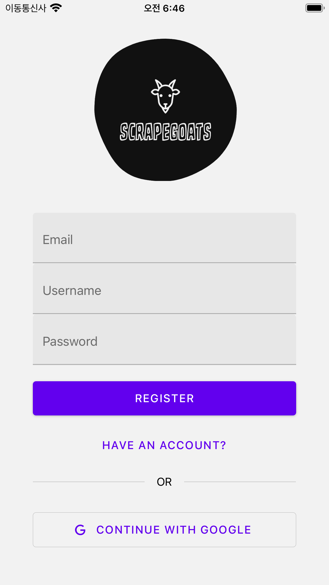
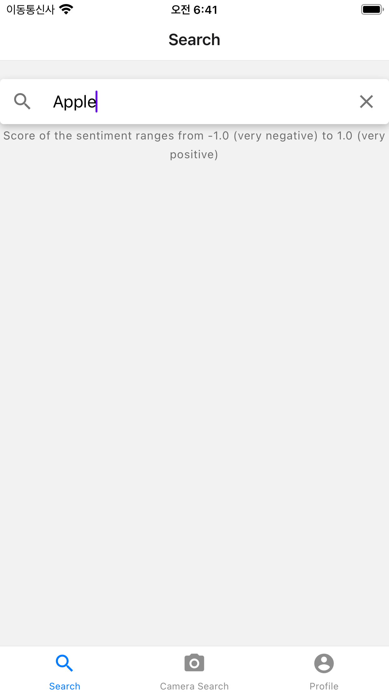
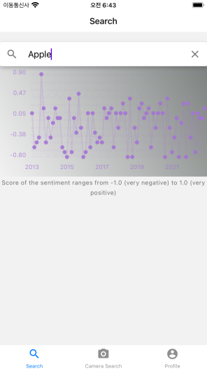

# Scrape Goats

Scrape Goats is a simple iOS application integrating web scraping with Google's Natural Language & Cloud Vision APIs for sentiment analysis over the history of a term's usage on twitter.

The Scrape Goats project was created for the Purdue BoilerMake 2022 hackathon competition. It was developed over a period of 36 hours by **Kichul Kang** (*Github: kckang1103*), **John Werner** (*Github: jwerner51*), and **Thomas Wiegand** (*Github: twiegan*). 

 

# Technologies

- Frontend - React Native
- Backend - Django
- Authentication - Firebase

 

# Gallery

Login 

Search 

Graph 

